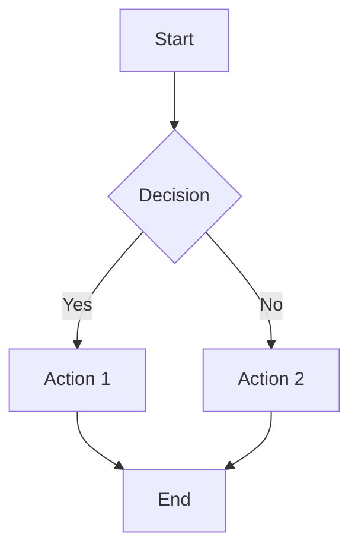
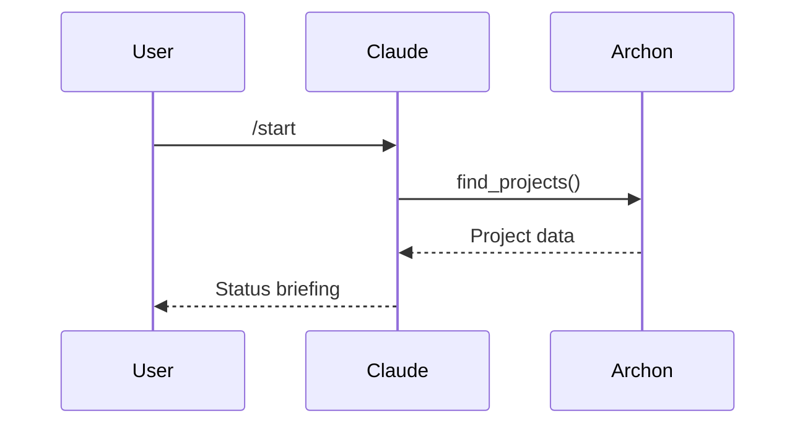

[Home](../README.md) > [Docs](./index.md) > Style Guide

# Documentation Style Guide

> **Last Updated**: 2026-02-18 | **Status**: Final

This guide establishes standards for documentation within Claude Code Base projects.

---

## Table of Contents

- [File Naming Conventions](#file-naming-conventions)
- [Markdown Formatting](#markdown-formatting)
- [Code Block Styles](#code-block-styles)
- [Diagram Standards](#diagram-standards)
- [Link Conventions](#link-conventions)
- [Document Structure](#document-structure)
- [Writing Style](#writing-style)

---

## File Naming Conventions

### General Rules

| Type | Convention | Example |
|------|------------|---------|
| Documentation | `kebab-case.md` | `getting-started.md` |
| README files | `README.md` (uppercase) | `README.md` |
| Style guides | `STYLE_GUIDE.md` or `UPPERCASE.md` | `STYLE_GUIDE.md` |
| Changelogs | `CHANGELOG.md` | `CHANGELOG.md` |
| Templates | `*-template.md` | `plan-template.md` |

### PRP Framework Files

| Type | Pattern | Example |
|------|---------|---------|
| PRD files | `[feature-slug].prd.md` | `user-auth.prd.md` |
| Plan files | `[feature-slug]-phase-[n].plan.md` | `user-auth-phase-1.plan.md` |
| Issue files | `[issue-number]-[description].md` | `123-login-timeout.md` |
| Reports | `[date]-[feature]-report.md` | `2026-01-23-auth-report.md` |

### Skill and Command Files

| Type | Convention | Example |
|------|------------|---------|
| Skill directory | `lowercase-with-hyphens/` | `archon-workflow/` |
| Skill file | `SKILL.md` (always) | `SKILL.md` |
| Command file | `[command-name].md` | `start.md` |

---

## Markdown Formatting

### Headings

Use ATX-style headings with proper hierarchy:

```markdown
# Document Title (H1 - only one per document)

## Major Section (H2)

### Subsection (H3)

#### Minor Subsection (H4 - rarely needed)
```

**Rules**:
- One `#` (H1) per document
- Don't skip levels (H2 -> H4)
- Use sentence case for headings
- Add blank line before and after headings

### Lists

**Unordered lists** - Use `-` consistently:

```markdown
- Item one
- Item two
  - Nested item
  - Another nested
- Item three
```

**Ordered lists** - Use `1.` for all items (auto-numbered):

```markdown
1. First step
1. Second step
1. Third step
```

**Task lists**:

```markdown
- [x] Completed task
- [ ] Pending task
- [ ] Another pending task
```

### Tables

Align columns for readability:

```markdown
| Column 1   | Column 2      | Column 3 |
|------------|---------------|----------|
| Short      | Medium length | Long     |
| Data       | More data     | Even more data here |
```

**Rules**:
- Include header row
- Use alignment (`:---`, `:---:`, `---:`) when helpful
- Keep tables under 5 columns when possible

### Emphasis

| Style | Syntax | Usage |
|-------|--------|-------|
| **Bold** | `**text**` | Important terms, UI elements |
| *Italic* | `*text*` | Emphasis, new terms |
| `Code` | `` `text` `` | Code, commands, file names |
| ~~Strikethrough~~ | `~~text~~` | Deprecated items |

### Blockquotes

Use for callouts, notes, and warnings:

```markdown
> **Note**: This is important information.

> **Warning**: This action cannot be undone.

> **Tip**: This is a helpful suggestion.
```

---

## Code Block Styles

### Fenced Code Blocks

Always specify the language:

```markdown
```python
def hello():
    print("Hello, world!")
```
```

### Common Language Tags

| Language | Tag | Example Use |
|----------|-----|-------------|
| Python | `python` | Scripts, Archon calls |
| TypeScript | `typescript` | Type definitions |
| JavaScript | `javascript` | Node.js code |
| PowerShell | `powershell` | Windows scripts |
| Bash | `bash` | Unix commands |
| YAML | `yaml` | Configuration |
| JSON | `json` | Data, config |
| Markdown | `markdown` | Documentation examples |

### Inline Code

Use backticks for:
- File names: `CLAUDE.md`
- Commands: `/start`
- Function names: `manage_task()`
- Variables: `project_id`
- Paths: `.claude/config.yaml`

### Command Examples

Show command and output separately:

```markdown
**Command:**
```bash
git status
```

**Output:**
```
On branch main
nothing to commit, working tree clean
```
```

---

## Diagram Standards

### Mermaid Diagrams

Use Mermaid for:
- Flowcharts
- Sequence diagrams
- Architecture diagrams
- State diagrams

#### Flowchart Example

```markdown

```

#### Sequence Diagram Example

```markdown

```

### ASCII Diagrams

For simple diagrams or when Mermaid isn't supported:

```
+-------------------+
|    Component A    |
+--------+----------+
         |
         v
+-------------------+
|    Component B    |
+-------------------+
```

### Directory Trees

Use consistent formatting:

```
project/
├── src/
│   ├── components/
│   │   └── Button.tsx
│   └── index.ts
├── tests/
│   └── button.test.ts
└── package.json
```

---

## Link Conventions

### Internal Links

Use relative paths:

```markdown
[Getting Started](./getting-started.md)
[Architecture](./architecture.md#components)
[Back to Index](./index.md)
```

### External Links

Use descriptive text (not raw URLs):

```markdown
<!-- Good -->
[Claude Code Documentation](https://docs.anthropic.com/en/docs/claude-code)

<!-- Avoid -->
https://docs.anthropic.com/en/docs/claude-code
```

### Anchor Links

Link to headings within documents:

```markdown
[See Configuration](#configuration)
[MCP Servers](./mcp-dependencies.md#required-servers)
```

### Breadcrumb Navigation

Include at the top of all documentation pages:

```markdown
[Home](../README.md) > [Docs](./index.md) > Current Page
```

---

## Document Structure

### Required Elements

Every documentation file MUST include:

1. **Breadcrumb navigation** (top)
2. **Title** (H1)
3. **Meta information** (Last Updated, Status)
4. **Table of Contents** (if >3 sections)
5. **Content sections**
6. **Related links** (bottom)

### Standard Template

```markdown
[Home](../README.md) > [Docs](./index.md) > Page Title

# Page Title

> **Last Updated**: YYYY-MM-DD | **Status**: Draft | Review | Final

Brief description of what this document covers.

---

## Table of Contents

- [Section 1](#section-1)
- [Section 2](#section-2)
- [Section 3](#section-3)

---

## Section 1

Content here...

---

## Section 2

Content here...

---

## Related Documents

- [Related Doc 1](./related-1.md)
- [Related Doc 2](./related-2.md)

---

*[Back to Documentation Index](./index.md)*
```

### Section Separators

Use horizontal rules (`---`) to separate major sections:

```markdown
## Section 1

Content...

---

## Section 2

Content...
```

---

## Writing Style

### Voice and Tone

| Do | Don't |
|----|-------|
| Use active voice | Use passive voice excessively |
| Be concise | Be verbose |
| Use "you" for instructions | Use "one" or impersonal constructs |
| Write in present tense | Mix tenses unnecessarily |

### Terminology

Be consistent with terms:

| Preferred | Avoid |
|-----------|-------|
| Claude Code | claude code, Claude-Code |
| CLAUDE.md | claude.md, Claude.md |
| Archon | archon, ARCHON |
| MCP server | MCP Server, mcp server |
| slash command | Slash Command, /command |

### Examples

Always include examples for:
- Commands and their output
- Configuration files
- API calls
- Complex processes

### Accessibility

- Use descriptive link text (not "click here")
- Provide alt text for images
- Use sufficient heading hierarchy
- Ensure color is not the only indicator

---

## Checklist

Before committing documentation:

- [ ] File name follows conventions
- [ ] Breadcrumb navigation present
- [ ] Title and meta information included
- [ ] Table of contents for long documents
- [ ] Code blocks have language tags
- [ ] Links are relative and working
- [ ] No typos or grammatical errors
- [ ] Consistent formatting throughout
- [ ] Examples provided where helpful

---

## Related Documents

- [Architecture](./architecture.md)
- [Customization Guide](./claude-code-customization.md)
- [Contributing Guidelines](../CONTRIBUTING.md)

---

*[Back to Documentation Index](./index.md)*
