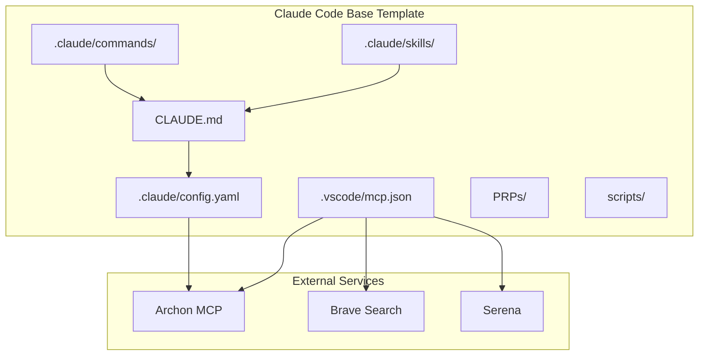
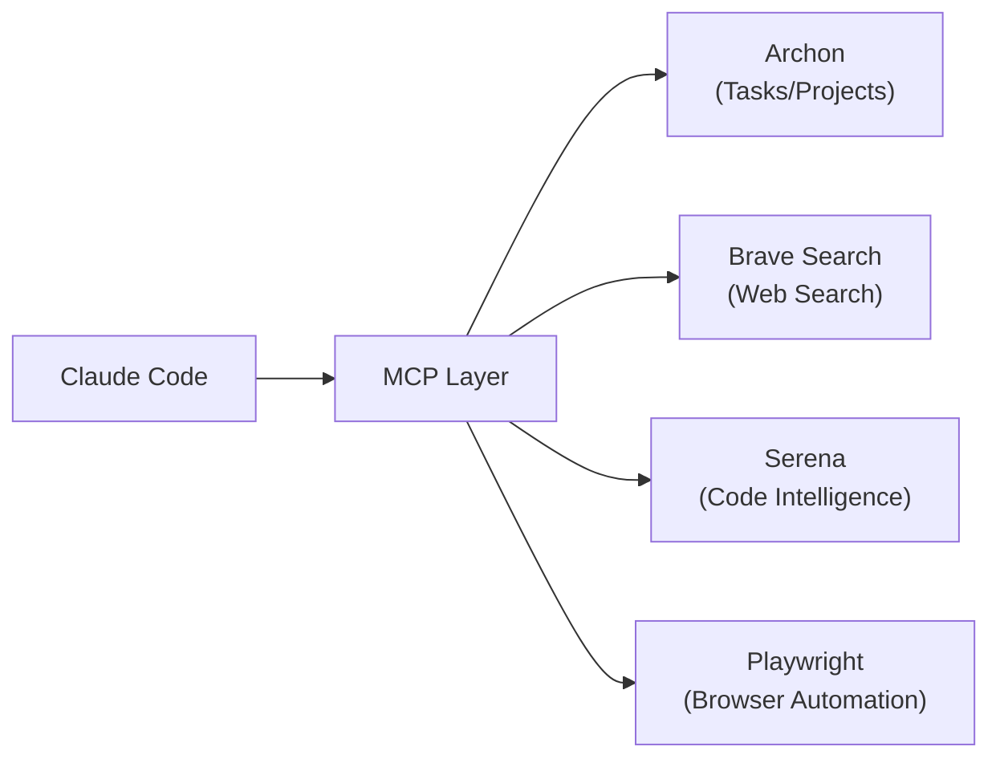
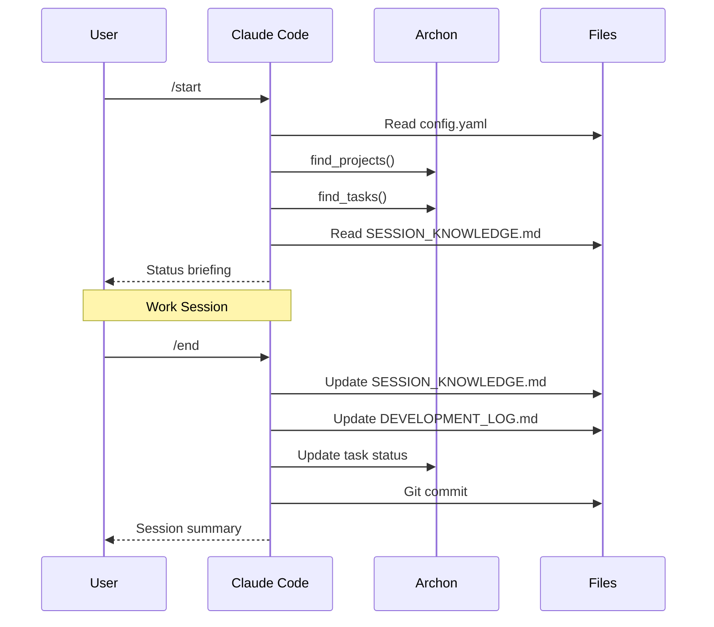
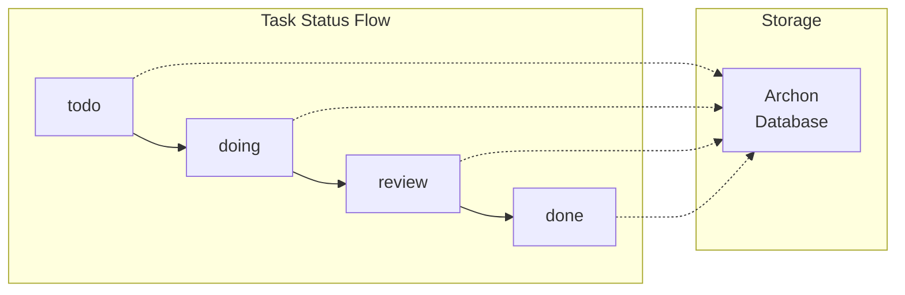
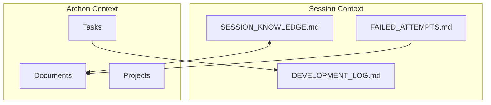
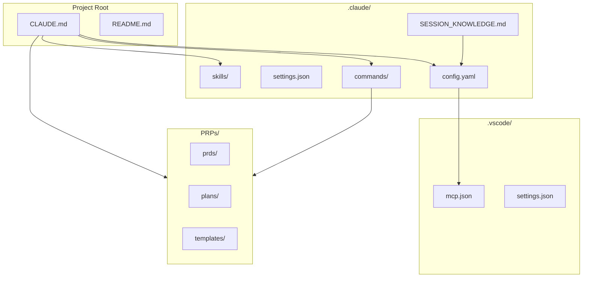

[Home](../README.md) > [Docs](./index.md) > Architecture

# Template Architecture

> **Last Updated**: 2026-02-18 | **Status**: Final

This document describes the structure and components of the Claude Code Base template.

---

## Table of Contents

- [Overview](#overview)
- [Directory Structure](#directory-structure)
- [Component Descriptions](#component-descriptions)
- [Data Flow](#data-flow)
- [Extension Points](#extension-points)
- [File Relationships](#file-relationships)

---

## Overview

Claude Code Base is a template repository that provides standardized configuration for Claude Code projects. It establishes conventions for:

- **Session management**: Start, status, and end workflows
- **Task tracking**: Archon integration for persistent task management
- **Structured development**: PRP framework for feature implementation
- **Security**: Pre-commit hooks for secret scanning
- **Extensibility**: Skills and commands for custom behaviors



---

## Directory Structure

```
claude-code-base/
├── CLAUDE.md                           # Main Claude Code instructions
├── README.md                           # Project overview
├── CHANGELOG.md                        # Version history
├── CONTRIBUTING.md                     # Contribution guidelines
├── SECURITY.md                         # Security policy
├── LICENSE                             # MIT license
├── CODEOWNERS                          # Code ownership
│
├── .claude/                            # Claude Code configuration
│   ├── config.yaml                     # Archon project link
│   ├── settings.json                   # Claude Code settings
│   ├── settings.local.json.example     # Local settings template
│   ├── SESSION_KNOWLEDGE.md            # Session context storage
│   ├── DEVELOPMENT_LOG.md              # Development activity log
│   ├── FAILED_ATTEMPTS.md              # Failed approaches log
│   │
│   ├── commands/                       # Slash commands
│   │   ├── README.md                   # Commands documentation
│   │   ├── start.md                    # /start command
│   │   ├── status.md                   # /status command
│   │   ├── end.md                      # /end command
│   │   ├── sync.md                     # /sync command
│   │   ├── validate.md                 # /validate command
│   │   ├── new-project.md              # /new-project command
│   │   ├── prp-prd.md                  # /prp-prd command
│   │   ├── prp-plan.md                 # /prp-plan command
│   │   └── prp-implement.md            # /prp-implement command
│   │
│   ├── skills/                         # Model-invoked skills
│   │   ├── README.md                   # Skills documentation
│   │   ├── archon-workflow/SKILL.md    # Archon task management
│   │   ├── code-review/SKILL.md        # Code review practices
│   │   ├── documentation/SKILL.md      # Technical documentation
│   │   ├── git-workflow/SKILL.md       # Advanced Git operations
│   │   ├── github/SKILL.md             # GitHub operations
│   │   ├── mcp-development/SKILL.md    # MCP server development
│   │   ├── prompt-engineering/SKILL.md # Prompt engineering
│   │   └── prp-framework/SKILL.md      # PRP methodology
│   │
│   ├── context/                        # Context files
│   │   └── README.md                   # Context documentation
│   │
│   └── hooks/                          # Lifecycle hooks
│       └── README.md                   # Hooks documentation
│
├── .vscode/                            # VS Code configuration
│   ├── settings.json                   # Editor settings
│   ├── extensions.json                 # Recommended extensions
│   ├── keybindings.json                # Custom keybindings
│   └── mcp.json                        # MCP server configuration
│
├── PRPs/                               # PRP framework artifacts
│   ├── README.md                       # PRP documentation
│   ├── prds/                           # Product requirement documents
│   │   └── .gitkeep
│   ├── plans/                          # Implementation plans
│   │   ├── .gitkeep
│   │   └── completed/                  # Archived plans
│   ├── issues/                         # Issue investigations
│   │   ├── .gitkeep
│   │   └── completed/                  # Archived investigations
│   ├── reports/                        # Implementation reports
│   │   └── .gitkeep
│   └── templates/                      # Reusable templates
│       ├── prd-template.md
│       ├── plan-template.md
│       ├── issue-investigation-template.md
│       └── implementation-report-template.md
│
├── templates/                          # Configuration templates
│   ├── manifest.json                   # Skill/command group definitions
│   ├── plugin-skill-map.json           # Plugin-to-skill coverage map
│   ├── claude-md/                      # CLAUDE.md templates
│   ├── readme/                         # README templates by project type
│   └── gitignore/                      # Language-specific gitignore
│
├── scripts/                            # PowerShell scripts
│   ├── setup-claude-code-project.ps1   # New project wizard
│   ├── sync-claude-code.ps1            # Intelligent sync wizard (v3.0)
│   └── validate-claude-code.ps1        # Validation utility
│
├── docs/                               # Documentation
│   ├── index.md                        # Documentation home
│   ├── getting-started.md              # Setup guide
│   ├── architecture.md                 # This file
│   ├── FAQ.md                          # Common questions
│   ├── STYLE_GUIDE.md                  # Documentation standards
│   ├── quick-reference.md              # Command cheat sheet
│   ├── migration-guide.md              # Migration from Copilot
│   ├── mcp-dependencies.md             # MCP server setup
│   └── claude-code-customization.md    # Customization guide
│
├── .gitignore                          # Git ignore rules
├── .gitattributes                      # Git attributes
└── .pre-commit-config.yaml             # Pre-commit hooks
```

---

## Component Descriptions

### Core Configuration

#### CLAUDE.md

The central instructions file that Claude Code reads at the start of every session.

| Section | Purpose |
|---------|---------|
| Critical Rules | Mandatory behaviors (Archon-first, temp files, security) |
| Project Reference | Archon project ID, GitHub repo, paths |
| Startup Protocol | Steps to execute at session start |
| Archon Integration | Task and document management |
| PRP Framework | Structured development workflow |
| Code Style | Language-specific guidelines |
| Git Workflow | Branch strategy, commit format |
| End of Session | Context preservation steps |

#### .claude/config.yaml

Links the project to Archon and defines project settings.

```yaml
archon_project_id: "uuid-here"      # Archon project link
project_title: "Project Name"        # Human-readable name
github_repo: "https://github.com/..." # Repository URL
local_path: "E:\Repos\..."           # Filesystem path
default_branch: "main"               # Main branch name
default_assignee: "Claude Code"      # Default task assignee
```

### Commands

Slash commands are user-invoked actions. When you type `/command`, Claude executes the instructions in the corresponding `.md` file.

| Command | File | Purpose |
|---------|------|---------|
| `/start` | `start.md` | Initialize session, load context |
| `/status` | `status.md` | Show project/task status |
| `/end` | `end.md` | Save context, commit work |
| `/sync` | `sync.md` | Sync Claude Code files |
| `/validate` | `validate.md` | Check configuration |
| `/new-project` | `new-project.md` | Create new project |
| `/prp-prd` | `prp-prd.md` | Create PRD |
| `/prp-plan` | `prp-plan.md` | Create implementation plan |
| `/prp-implement` | `prp-implement.md` | Execute plan |

### Skills

Skills are model-invoked based on context matching. Claude automatically activates relevant skills.

| Skill | Triggers | Purpose |
|-------|----------|---------|
| `archon-workflow` | task, project, rag | Task/document management |
| `github` | PR, issue, Actions | GitHub operations |
| `git-workflow` | rebase, cherry-pick | Advanced Git |
| `code-review` | review, audit | Code review practices |
| `documentation` | docs, readme | Technical writing |
| `mcp-development` | mcp, tool provider | MCP server development |
| `prompt-engineering` | prompt, CoT | Prompt optimization |
| `prp-framework` | prp, prd | Structured development |

### MCP Configuration

`.vscode/mcp.json` defines Model Context Protocol servers that extend Claude's capabilities.



### PRP Framework

The Product Requirement Prompt framework provides structured development:

```
Feature Idea
    │
    ▼
┌─────────────────┐
│   PRD Phase     │  ← Problem definition, phases
└────────┬────────┘
         │
         ▼
┌─────────────────┐
│   Plan Phase    │  ← Codebase exploration, patterns
└────────┬────────┘
         │
         ▼
┌─────────────────┐
│ Implement Phase │  ← Task execution, validation
└────────┬────────┘
         │
         ▼
┌─────────────────┐
│  Report Phase   │  ← Documentation, lessons
└─────────────────┘
```

### Templates

Configuration templates that drive the setup and sync wizards:

| File | Purpose |
|------|---------|
| `templates/manifest.json` | Defines skill groups, command groups, project type mappings, language/framework options |
| `templates/plugin-skill-map.json` | Maps global Claude Code plugins to the local skills they cover (for deduplication) |
| `templates/claude-md/CLAUDE.md.template` | CLAUDE.md template with conditional sections for PRP/Harness/SpecKit |
| `templates/readme/` | Project-type-specific README templates |
| `templates/gitignore/` | Language-specific gitignore templates |

### Scripts

PowerShell scripts for project management:

| Script | Purpose |
|--------|---------|
| `setup-claude-code-project.ps1` | Interactive wizard for creating new projects from template |
| `sync-claude-code.ps1` (v3.0) | Intelligent wizard-based additive sync for existing projects |
| `validate-claude-code.ps1` | Validate configuration meets standards |
| `update-project.ps1` | Selective component updates from template |

---

## Data Flow

### Session Lifecycle



### Task Management Flow



### Context Persistence



---

## Extension Points

### Adding Commands

1. Create `.claude/commands/[name].md`
2. Add YAML frontmatter with `name` and `description`
3. Write instructions for Claude to follow

```markdown
---
name: my-command
description: What this command does
---

# /my-command

Instructions here...
```

### Adding Skills

1. Create `.claude/skills/[skill-name]/SKILL.md`
2. Add YAML frontmatter with `name` and `description`
3. Write trigger conditions and instructions

```markdown
---
name: my-skill
description: When to use this skill. Keywords: trigger1, trigger2
---

# My Skill

## When to Use
- Condition 1
- Condition 2

## Instructions
Step-by-step guidance...
```

### Adding MCP Servers

1. Edit `.vscode/mcp.json`
2. Add server configuration
3. Set required environment variables

```json
{
  "servers": {
    "new-server": {
      "command": "cmd",
      "args": ["/c", "npx", "-y", "@example/mcp-server"],
      "env": {
        "API_KEY": "${API_KEY}"
      }
    }
  }
}
```

### Customizing CLAUDE.md

See [Customization Guide](./claude-code-customization.md) for detailed instructions.

---

## File Relationships



---

## Related Documents

- [Getting Started](./getting-started.md) - Setup instructions
- [Customization Guide](./claude-code-customization.md) - How to customize
- [MCP Dependencies](./mcp-dependencies.md) - MCP server setup
- [Quick Reference](./quick-reference.md) - Command cheat sheet

---

*[Back to Documentation Index](./index.md)*
