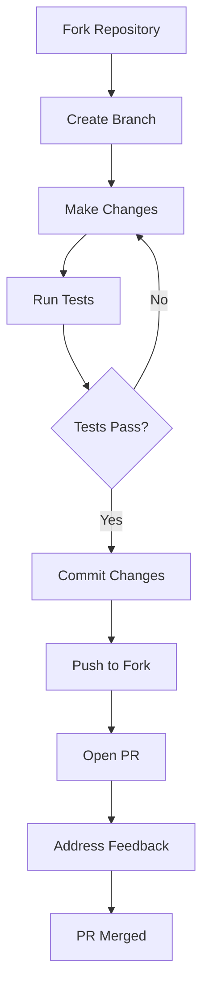

[Home](../README.md) > [Docs](./index.md) > Contributing Guide

# Contributing to Claude Code Base

> **Last Updated**: 2026-02-02 | **Status**: Final

Thank you for your interest in contributing to Claude Code Base! This comprehensive guide covers everything you need to know to contribute skills, commands, scripts, and documentation.

---

## Table of Contents

- [Getting Started](#getting-started)
- [Contributing Skills](#contributing-skills)
- [Contributing Commands](#contributing-commands)
- [Contributing Scripts](#contributing-scripts)
- [Pull Request Process](#pull-request-process)
- [Code of Conduct](#code-of-conduct)
- [Recognition](#recognition)

---

## Getting Started

### Fork and Clone

1. **Fork the repository** on GitHub:

   Navigate to [HouseGarofalo/claude-code-base](https://github.com/HouseGarofalo/claude-code-base) and click "Fork"

2. **Clone your fork**:

   ```bash
   gh repo clone YOUR_USERNAME/claude-code-base
   cd claude-code-base
   ```

3. **Add upstream remote**:

   ```bash
   git remote add upstream https://github.com/HouseGarofalo/claude-code-base.git
   ```

4. **Keep your fork synced**:

   ```bash
   git fetch upstream
   git checkout main
   git merge upstream/main
   ```

### Development Environment Setup

**Prerequisites:**

| Tool | Version | Purpose |
|------|---------|---------|
| Git | 2.40+ | Version control |
| PowerShell | 7.0+ | Script execution |
| Python | 3.10+ | Pre-commit hooks |
| Node.js | 18+ | Optional, for TypeScript skills |
| GitHub CLI | 2.0+ | PR and issue management |

**Setup Steps:**

```bash
# 1. Install pre-commit
pip install pre-commit

# 2. Install hooks
pre-commit install
pre-commit install --hook-type commit-msg

# 3. Verify installation
pre-commit run --all-files
```

### Running Tests Locally

**Template Validation:**

```powershell
# Run all template tests
.\tests\test-template.ps1

# Run with verbose output
.\tests\test-template.ps1 -Verbose
```

**Skill Validation:**

```powershell
# Test all skills
.\tests\test-skills.ps1

# Test specific skill path
.\tests\test-skills.ps1 -SkillsPath ".\.claude\skills\devops"

# Show detailed output
.\tests\test-skills.ps1 -ShowDetails

# Stop on first failure
.\tests\test-skills.ps1 -FailFast
```

**Manual Validation:**

```powershell
# Validate configuration files
.\scripts\validate-claude-code.ps1

# Check YAML syntax
python -c "import yaml; yaml.safe_load(open('.claude/config.yaml'))"
```

### Understanding the Codebase

```
claude-code-base/
├── .claude/
│   ├── commands/          # Slash commands (*.md)
│   ├── skills/            # Model-invoked skills
│   ├── hooks/             # Tool hooks
│   ├── config.yaml        # Archon configuration
│   └── settings.json      # Claude Code settings
├── scripts/               # PowerShell utilities
├── tests/                 # Test suites
├── docs/                  # Documentation
├── PRPs/                  # PRP framework
└── .github/               # GitHub templates
```

---

## Contributing Skills

Skills are the core of Claude Code's extensibility. They provide specialized knowledge and workflows that Claude invokes automatically based on context.

### Skill Naming Conventions

| Rule | Example | Invalid |
|------|---------|---------|
| Lowercase only | `kubernetes-helm` | `Kubernetes-Helm` |
| Hyphens for separation | `aws-lambda` | `aws_lambda`, `awslambda` |
| Start with letter | `react-typescript` | `1-react-typescript` |
| Max 64 characters | `docker-compose` | Names exceeding limit |
| No consecutive hyphens | `pydantic-ai` | `pydantic--ai` |
| No trailing hyphens | `langchain` | `langchain-` |

**Good Names:**

- `kubernetes-helm`
- `nextjs-app-router`
- `azure-ai`
- `playwright-mcp`

**Bad Names:**

- `KubernetesHelm` (uppercase)
- `kubernetes_helm` (underscore)
- `my-super-long-skill-name-that-exceeds-the-limit` (too long)

### SKILL.md Format Requirements

Every skill must have a `SKILL.md` file with proper YAML frontmatter:

```markdown
---
name: skill-name
description: A clear, concise description of what this skill does and when to use it. Maximum 1024 characters.
---

# Skill Title

## Triggers

Use this skill when you see:
- keyword1, keyword2
- specific phrases or contexts
- technology or tool names

## Instructions

### Section 1: Getting Started

[Instructions for the AI]

### Section 2: Common Tasks

[More instructions]

## Best Practices

1. Best practice 1
2. Best practice 2

## Common Workflows

### Workflow 1
1. Step one
2. Step two
```

**Frontmatter Requirements:**

| Field | Required | Constraints |
|-------|----------|-------------|
| `name` | Yes | Lowercase, hyphens only, max 64 chars |
| `description` | Yes | Max 1024 characters, no multiline |

**Description Guidelines:**

- Start with what the skill does: "Comprehensive GitHub operations via gh CLI"
- Include when to use it: "Use for repository management, pull requests, and CI/CD"
- Be specific about capabilities: "Supports issues, PRs, Actions, releases, and security"
- Keep under 1024 characters (hard limit enforced by Claude Code)

### Skill Directory Structure

```
.claude/skills/
├── category-name/
│   └── skill-name/
│       ├── SKILL.md        # Required: Main skill file
│       ├── examples/       # Optional: Example code
│       │   ├── basic.py
│       │   └── advanced.py
│       └── templates/      # Optional: Templates
│           └── config.yaml
```

### Skill Categories

Place skills in the appropriate category:

| Category | Purpose |
|----------|---------|
| `ai-development` | AI frameworks (LangChain, LlamaIndex, CrewAI) |
| `cloud` | Cloud providers (AWS, Azure, Cloudflare) |
| `devops` | DevOps tools (Docker, Kubernetes, Terraform) |
| `frontend` | Frontend frameworks (React, Vue, Svelte) |
| `networking` | Networking tools (nginx, HAProxy) |
| `productivity` | Productivity tools (Obsidian, Excalidraw) |
| `web-automation` | Browser automation (Playwright) |
| `data-visualization` | Dashboards and charts |
| `database` | Database tools and ORMs |
| `security` | Security tools and practices |

### Testing Skills Before Submitting

1. **Validate syntax**:

   ```powershell
   .\tests\test-skills.ps1 -SkillsPath ".\.claude\skills\your-category\your-skill"
   ```

2. **Check for duplicates**:

   ```powershell
   .\tests\test-skills.ps1 -ShowDetails | Select-String "duplicate"
   ```

3. **Test in Claude Code**:

   - Deploy skill locally: `Copy-Item -Recurse ".\.claude\skills\your-skill" "$env:USERPROFILE\.claude\skills\"`
   - Restart Claude Code
   - Test triggers and instructions

4. **Verify description length**:

   ```powershell
   $content = Get-Content ".\.claude\skills\your-category\your-skill\SKILL.md" -Raw
   if ($content -match 'description:\s*(.+)') {
       $desc = $Matches[1]
       Write-Host "Description length: $($desc.Length) characters"
       if ($desc.Length -gt 1024) { Write-Warning "Exceeds 1024 limit!" }
   }
   ```

### Skill Contribution Checklist

- [ ] Skill name follows naming conventions
- [ ] `SKILL.md` has valid YAML frontmatter
- [ ] `name` field is lowercase with hyphens only
- [ ] `description` is under 1024 characters
- [ ] Description clearly explains purpose and triggers
- [ ] Placed in correct category directory
- [ ] No duplicate skill names in repository
- [ ] Passes `test-skills.ps1` validation
- [ ] Tested locally in Claude Code
- [ ] Instructions are clear and actionable
- [ ] Includes trigger keywords section
- [ ] Includes best practices section

---

## Contributing Commands

Commands are slash commands (`/command`) that users invoke explicitly.

### Command Format Requirements

Commands are Markdown files in `.claude/commands/`:

```markdown
# Command Name

Brief description of what this command does.

## Usage

/command-name [options]

## Parameters

- `option1`: Description of option 1
- `option2`: Description of option 2

## Instructions

When the user invokes this command:

1. First, do this
2. Then, do that
3. Finally, complete with this

## Examples

### Example 1: Basic Usage
/command-name

### Example 2: With Options
/command-name --verbose

## Notes

- Important note 1
- Important note 2
```

### Command Naming

The filename becomes the command name:

| Filename | Command |
|----------|---------|
| `start.md` | `/start` |
| `git-commit.md` | `/git-commit` |
| `pr-create.md` | `/pr-create` |

**Guidelines:**

- Use lowercase with hyphens
- Keep names short and memorable
- Group related commands with prefixes (`git-`, `pr-`, `prp-`)

### Command Categories

Organize commands by purpose:

| Category | Examples |
|----------|----------|
| Session management | `start`, `status`, `end` |
| Git operations | `git-commit`, `git-branch`, `git-sync` |
| GitHub operations | `pr-create`, `pr-review`, `issue-create` |
| Code operations | `fix`, `refactor`, `optimize` |
| Research | `research`, `technology-research` |
| PRP framework | `prp-prd`, `prp-plan`, `prp-implement` |

### Testing Commands

1. **Copy to local Claude Code**:

   ```powershell
   Copy-Item ".\.claude\commands\your-command.md" "$env:USERPROFILE\.claude\commands\"
   ```

2. **Test invocation** in Claude Code session

3. **Verify instructions** produce expected behavior

### Command Contribution Checklist

- [ ] File is named `command-name.md` (lowercase, hyphens)
- [ ] Has clear description at top
- [ ] Includes usage syntax
- [ ] Documents all parameters/options
- [ ] Provides clear instructions for Claude
- [ ] Includes examples
- [ ] Tested locally in Claude Code
- [ ] Doesn't duplicate existing commands

---

## Contributing Scripts

Scripts are PowerShell utilities in the `scripts/` directory.

### PowerShell Coding Standards

**Naming:**

| Element | Convention | Example |
|---------|------------|---------|
| Functions | PascalCase | `Write-Status`, `Get-SkillInfo` |
| Variables | camelCase | `$projectPath`, `$skillFiles` |
| Parameters | PascalCase | `-SourcePath`, `-DryRun` |
| Private functions | Use `script:` scope | `$script:Stats` |

**Documentation:**

Every script must include comment-based help:

```powershell
<#
.SYNOPSIS
    One-line description of script purpose.

.DESCRIPTION
    Detailed description of what the script does,
    including any important behaviors or limitations.

.PARAMETER ParamName
    Description of what this parameter does.

.EXAMPLE
    .\script-name.ps1
    Basic usage example.

.EXAMPLE
    .\script-name.ps1 -Verbose -DryRun
    Advanced usage with explanation.

.NOTES
    Author: Your Name
    Version: 1.0.0
    Exit Codes:
        0 - Success
        1 - Failure
#>
```

**Error Handling:**

```powershell
# Set error handling at script start
$ErrorActionPreference = 'Stop'

# Use try/catch for operations that may fail
try {
    # Risky operation
    Remove-Item $Path -Recurse -Force
}
catch {
    Write-Status "Failed to remove: $_" "ERROR"
    exit 1
}

# Validate inputs early
if (-not (Test-Path $SourcePath)) {
    Write-Status "Source path not found: $SourcePath" "ERROR"
    exit 1
}
```

**Output and Logging:**

```powershell
# Use consistent status functions
function Write-Status {
    param(
        [string]$Message,
        [ValidateSet('Info', 'Success', 'Warning', 'Error')]
        [string]$Type = 'Info'
    )

    $Color = switch ($Type) {
        'Info'    { 'Cyan' }
        'Success' { 'Green' }
        'Warning' { 'Yellow' }
        'Error'   { 'Red' }
    }

    $Prefix = switch ($Type) {
        'Info'    { '[INFO]' }
        'Success' { '[OK]' }
        'Warning' { '[WARN]' }
        'Error'   { '[ERROR]' }
    }

    Write-Host "$Prefix $Message" -ForegroundColor $Color
}
```

### Testing Requirements

**Unit Testing:**

Create corresponding test files in `tests/`:

```powershell
# tests/test-your-script.ps1
Describe "Your-Script" {
    Context "When given valid input" {
        It "Should return expected output" {
            $result = .\scripts\your-script.ps1 -Input "test"
            $result | Should -Be "expected"
        }
    }

    Context "When given invalid input" {
        It "Should exit with code 1" {
            { .\scripts\your-script.ps1 -Input $null } | Should -Throw
        }
    }
}
```

**Manual Testing:**

1. Test with valid inputs
2. Test with invalid inputs (should fail gracefully)
3. Test with `-DryRun` if supported
4. Test on clean system (no assumptions about environment)

### Script Contribution Checklist

- [ ] Comment-based help is complete
- [ ] Functions use PascalCase naming
- [ ] Variables use camelCase naming
- [ ] Error handling is implemented
- [ ] Exit codes are documented
- [ ] `-DryRun` parameter included (if applicable)
- [ ] `-Verbose` support included
- [ ] Tested on Windows PowerShell 7+
- [ ] No hardcoded paths (use parameters)
- [ ] Passes `PSScriptAnalyzer` checks

---

## Pull Request Process

### Branch Naming Conventions

| Type | Pattern | Example |
|------|---------|---------|
| Feature | `feature/description` | `feature/add-kubernetes-skill` |
| Bug fix | `fix/description` | `fix/skill-validation-error` |
| Documentation | `docs/description` | `docs/update-deployment-guide` |
| Chore | `chore/description` | `chore/update-dependencies` |

### Commit Message Format

We follow [Conventional Commits](https://www.conventionalcommits.org/):

```
<type>(<scope>): <description>

[optional body]

[optional footer(s)]
```

**Types:**

| Type | Purpose |
|------|---------|
| `feat` | New feature |
| `fix` | Bug fix |
| `docs` | Documentation changes |
| `style` | Formatting, no code change |
| `refactor` | Code restructuring |
| `test` | Adding or updating tests |
| `chore` | Maintenance tasks |

**Examples:**

```bash
# New skill
git commit -m "feat(skills): add kubernetes-helm skill for K8s deployments"

# Bug fix
git commit -m "fix(validation): handle empty skill descriptions"

# Documentation
git commit -m "docs(deployment): add CI/CD integration section"

# Chore
git commit -m "chore(deps): update pre-commit hooks to v4.6.0"
```

### PR Template Requirements

When opening a PR, fill out the template:

```markdown
## Summary

Brief description of changes (1-3 bullet points).

## Type of Change

- [ ] New skill
- [ ] New command
- [ ] New script
- [ ] Bug fix
- [ ] Documentation
- [ ] Other (describe)

## Testing

Describe how you tested the changes:
- [ ] Ran `test-skills.ps1`
- [ ] Ran `test-template.ps1`
- [ ] Tested locally in Claude Code
- [ ] Manual testing (describe)

## Checklist

- [ ] Code follows style guidelines
- [ ] Self-reviewed changes
- [ ] Added/updated documentation
- [ ] All tests pass
- [ ] No secrets or credentials included
```

### Review Process

1. **Automated Checks**: CI runs validation on all PRs
2. **Maintainer Review**: At least one maintainer must approve
3. **Feedback**: Address any requested changes
4. **Squash Merge**: PRs are squash-merged to main

**Review Timeline:**

- Initial review: Within 3 business days
- Follow-up reviews: Within 2 business days
- Emergency fixes: Expedited review available

### After Merge

1. PR is squash-merged to main
2. Your contribution appears in CHANGELOG.md
3. You're added to contributors list (if first contribution)
4. Changes available in next release

---

## Code of Conduct

### Expected Behavior

- **Be respectful**: Treat all contributors with respect
- **Be constructive**: Provide helpful feedback
- **Be inclusive**: Welcome newcomers
- **Be patient**: Remember everyone has different experience levels
- **Be collaborative**: Work together toward shared goals

### Unacceptable Behavior

- Harassment, discrimination, or exclusionary behavior
- Personal attacks or insults
- Trolling or inflammatory comments
- Publishing others' private information
- Any conduct inappropriate in a professional setting

### Reporting Issues

If you experience or witness unacceptable behavior:

1. **Document the incident** with screenshots/links
2. **Report to maintainers** via:
   - Email: [maintainer email]
   - GitHub: Open a private security advisory
3. **Expect response** within 48 hours

### Enforcement

Maintainers may take action including:

- Warning
- Temporary ban
- Permanent ban

All decisions are final and made at maintainers' discretion.

---

## Recognition

### Contributors List

Contributors are recognized in:

- `CONTRIBUTORS.md` file in repository
- GitHub contributors graph
- Release notes (for significant contributions)

### How Contributions Are Credited

| Contribution Type | Credit |
|------------------|--------|
| Skills | Listed in skill's SKILL.md author section |
| Commands | Listed in command file |
| Scripts | Listed in script's .NOTES section |
| Documentation | Listed in CONTRIBUTORS.md |
| Bug fixes | Mentioned in CHANGELOG.md |

### Becoming a Maintainer

Regular contributors may be invited to become maintainers. Criteria:

- Multiple accepted contributions
- Demonstrated understanding of project goals
- Constructive participation in discussions
- Reliable and responsive

---

## Quick Reference

### Contribution Workflow



### Common Commands

```bash
# Setup
gh repo clone YOUR_USERNAME/claude-code-base
pre-commit install

# Development
git checkout -b feature/my-feature
# ... make changes ...
.\tests\test-skills.ps1
.\tests\test-template.ps1

# Submit
git add .
git commit -m "feat(skills): add my-new-skill"
git push origin feature/my-feature
gh pr create
```

### Getting Help

- **Questions**: Open a GitHub Discussion
- **Bugs**: Open a GitHub Issue
- **Feature requests**: Open a GitHub Issue with `enhancement` label
- **Documentation**: Check [docs/](./index.md) first

---

## Related Documents

- [Getting Started](./getting-started.md)
- [Architecture](./architecture.md)
- [Deployment Guide](./deployment.md)
- [Style Guide](./STYLE_GUIDE.md)
- [Quick Reference](./quick-reference.md)

---

*[Back to Documentation Index](./index.md)*
